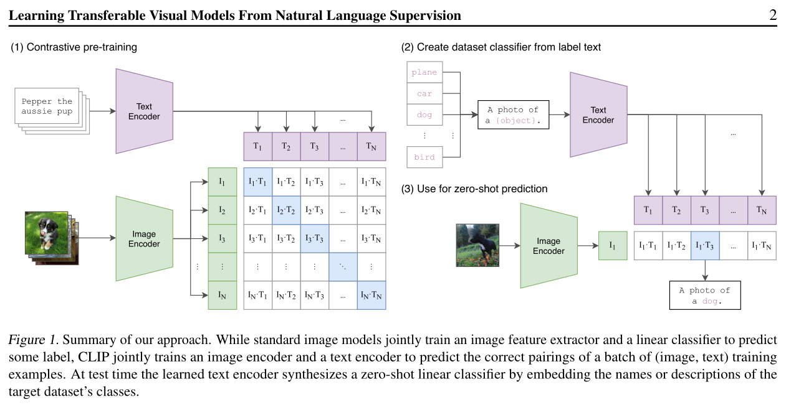
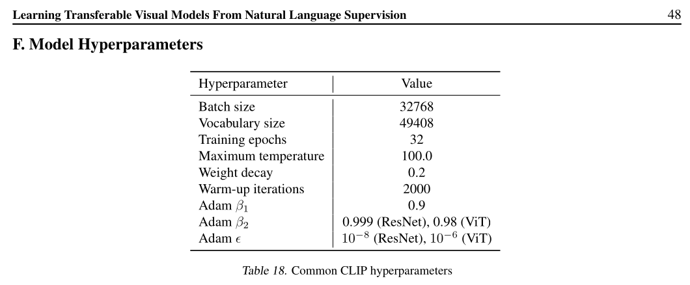
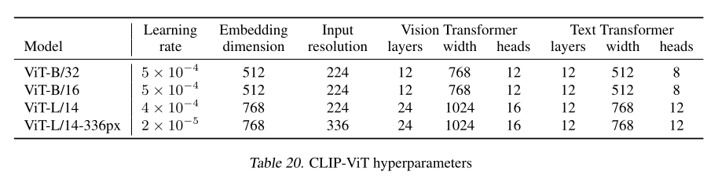

# MLXMultimodal

> by the Perceptron Party crew

## The task at hand

1. Learn how to use the hidden state from ViT or CLIP
2. Code the decoder from scratch
3. Create synthetic datasets and save them on Hugging Face
    - a) get used to it!
    - b) use [Qwen2.5-VL-3B-Instruct](https://huggingface.co/Qwen/Qwen2.5-VL-3B-Instruct)
4. Train and experiment with datasets and alignment
5. Use [Qwen/Qwen3-0.6B-Base](https://huggingface.co/Qwen/Qwen3-0.6B-Base) pre-trained as decoder

## Crucial insights from the CLIP paper

> [Learning Transferable Visual Models From Natural Language Supervision](https://arxiv.org/abs/2103.00020) (2021)

> **freemvmt's tl;dr:** CLIP is _not_ a classifier in the typical sense. It doesn't sort images into classes/buckets. And yet, we can _use_ a CLIP model to do classification after the fact. This is the 'transferable' quality named in the paper title, where we can apply our very _general_ text-image architecture for the specific task of zero-shot classification.

Figure 1 in the paper provides a useful diagrammatic overview:

Basically, **(1)** shows a two-tower model consisting of a text encoder and an image encoder, where for a given image-text pair, we seek to make the resulting image and text vectors _close_ in the final dimensional space. For our purposes both these 'encoders' would be fairly standard transformers. As per the C in **C**LIP, this is done _contrastively_, i.e. by pushing text and image samples which are not paired away from each other. This should sound familiar - it's all very [Week 2](https://github.com/freemvmt/two-towers-overlords).

**(2)** then shows how this _language-image pre-training_ (the LIP in C**LIP**) can be leveraged to create an image classifier simply by encoding a set of texts representing some set of buckets which we want to be able to categorise images into.

Once that's done, as shown by **(3)**, _any_ image can be embedded, and its nearest neighbours amongst the produced set of text embeddings calculated, in order to identify the most appropriate bucket. This is linear classification! Also note that the text embeddings can be crunched once, then re-used to classify any number of images.

**Section 3.1.2**, _Using CLIP for zero-shot transfer_, provides the most direct and succint description of the actual method by which CLIP can be repurposed as a classifier, as loosely explained above:

> CLIP is pre-trained to predict if an image and a text snippet are paired together in its dataset. To perform zero-shot classification, we reuse this capability. For each dataset, we use the names of all the classes in the dataset as the set of potential text pairings and predict the most probable (image, text) pair according to CLIP. In a bit more detail, we first compute the feature embedding of the image and the feature embedding of the set of possible texts by their respective encoders. The cosine similarity of these embeddings is then calculated, scaled by a temperature parameter τ, and normalized into a probability distribution via a softmax. Note that this prediction layer is a multinomial logistic regression classifier with L2-normalized inputs, L2-normalized weights, no bias, and temperature scaling. When interpreted this way, the image encoder is the computer vision backbone which computes a feature representation for the image and the text encoder is a hypernetwork (Ha et al., 2016) which generates the weights of a linear classifier based on the text specifying the visual concepts that the classes represent. Lei Ba et al. (2015) first introduced a zero-shot image classifier of this form while the idea of generating a classifier from natural language dates back to at least Elhoseiny et al. (2013). Continuing with this interpretation, every step of CLIP pre-training can be viewed as optimizing the performance of a randomly created proxy to a computer vision dataset which contains 1 example per class and has 32,768 total classes defined via natural language descriptions. For zero-shot evaluation, we cache the zero-shot classifier once it has been computed by the text encoder and reuse it for all subsequent predictions. This allows the cost of generating it to be amortized across all the predictions in a dataset.

Interesting concepts jumping out here, which may be worthy of further investigation:
- 'multinomial logistic regression classifier'
- 'hypernetwork'

### Hyperparams

